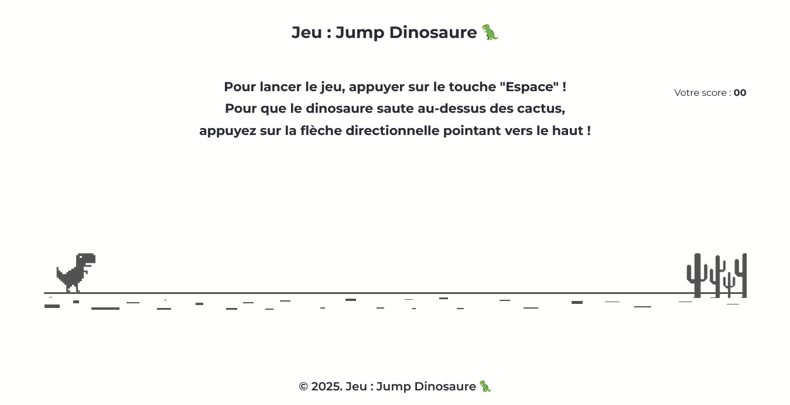
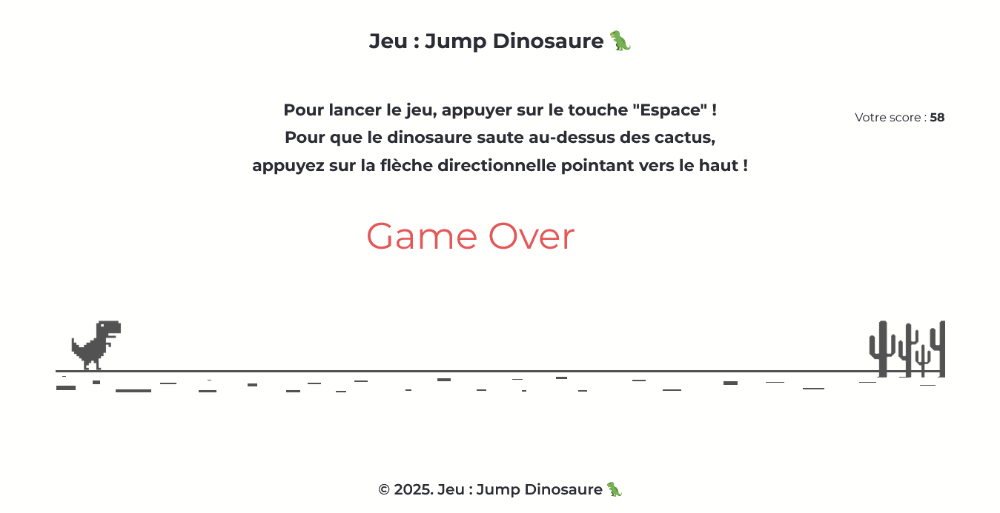

## JEU : JUMP DINOSAURE 🦖

## Le challenge

Création du jeu : Jump Dinosaure 🦖 en HTML5, CSS3 et JavaScript (jeu disponible uniquement sur ordinateur)

But du jeu : faire sauter le dinosaure au-dessus des cactus. S'il y a collision entre le dinosaure et les cactus, le jeu s'arrête !

Pour commencer à jouer, appuyez sur la touche "Espace".

Pour faire sauter le dinosaure, appuyez sur la flèche directionnelle pointant vers le haut.

## Démonstration

Lien vers le projet : https://aperbet56.github.io/jeu_jump_dinosaure/

## Projet développé avec

- Utilisation des balises sémantiques HTML5
- CSS3
- Flexbox
- Commentaires HTML5
- Commentaires CSS
- Animations css (@keyframes)
- Importation de la police "Montserrat"
- Utilisation d'un normaliseur : le fichier normalize.css
- JavaScript
- Code JavaScript commenté
